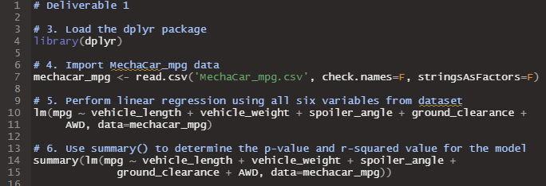
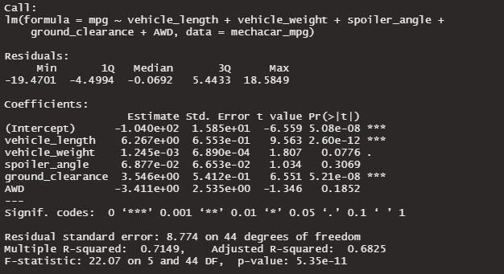
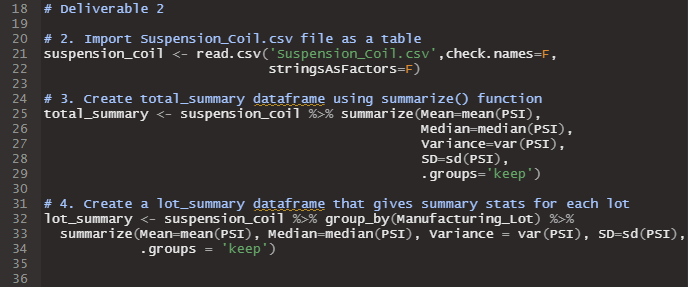
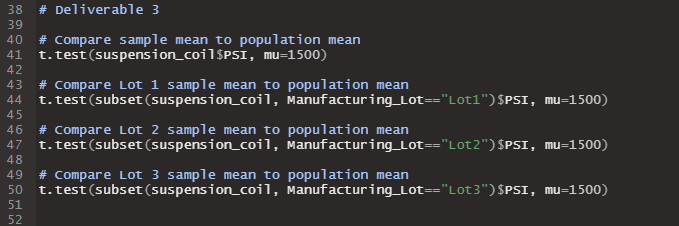
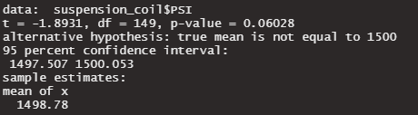
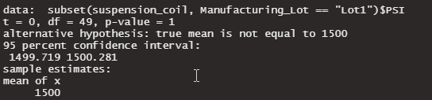
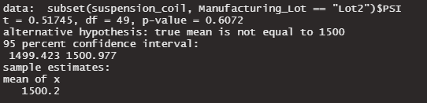
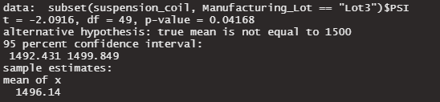

# MechaCar Statistical Analysis

This project used statistical analysis in R to predict fuel efficiency and analyze suspension coil manufacturing data for the automaker MechaCar. Multiple linaer regression was used to generate a linear model predicting the fuel efficiency in miles per gallon (mpg) from a sample of 50 prototype cars. Statistical analysis was also performed on manufacturing data for three lots of suspension coils. A summary of the analysis is presented below.

## Linear Regression to Predict MPG

The R script used to generate the multiple linear regression model is shown in Fig. 1. The dplyr library was imported to enable data manipulation and analysis on the MechaCar fuel efficiency dataset. The dataset was imported into the *mechacar_mpg* dataframe from the MechaCar_mpg.csv file, and multiple linear regression analysis was performed using the *lm()* function. 

*Figure 1. R script to generate multiple linear regression model to predict miles per gallon (mpg)*

The *summary()* function was used to determine the r-value and p-value for the linear model, and the results are shown in Fig. 2.

*Figure 2. Summary of multiple linear regression analysis on 50 MechaCar prototype vehicles*

From the information in Fig. 2, it is apparent that *vehicle_length* and *ground_clearance* provide a non-random amount of variance to the mpg dataset because the p-value is well below the significance level of 0.05. If a significance level of 0.1 were used, one could also infer that *vehicle_weight* contributes a non-random amount of variance. It is also interesting to note that the intercept also contributes to the mpg. This could imply that the significant variables (*vehicle_length* and *ground_clearance*) require transformation to improve the model, or there are additional variables not included in this dataset that contribute in a non-trivial manner to the mpg.

The slope of this linear model is non-zero because the coefficients associated with the variables included in the analysis are non-zero. For instance, *vehicle_weight* has a coefficient of 6.267, and *ground_clearance* has a coefficient of 3.546.

Does this linear model predict mpg of MechaCar prototypes effectively? Why or why not?

The linear model generated from this dataset does effectively predict the mpg for the MechaCar prototypes as the r-squared value is is 0.7149 giving an r-value of 0.8455 indicating strong correlation. Additionally, the p-value is 5.35e-11 which is considerably less than significance level of 0.05.

## Summary Statistics on Suspension Coils

Statistical analysis was performed for three manufacturing lots of suspension coil presssure in pounds per square inch (PSI) using the R script shown in Fig. 3. The suspension coil data was read into the *suspension_coil* dataframe from the *Suspension_Coil.csv* file. A total summary dataframe was generated with the *summarize()* function, and a dataframe summarizing the PSI for each manufacturing lot was generated by using the *group_by()* function in combination wit the *summarize()* function.

*Figure 3. R script to summarize statistics on the suspension coil PSI for three manufacturing lots*

The resulting dataframes are shown in Figs. 4 and 5, where Fig. 4 shows the total summary statistics for all manufacturing lots and Fig. 5 shows the summary statistics for each manufacturing lot individually.

*Figure 4. PSI summary statistics on all manufacturing lots*

*Figure 5. PSI summary statistics for each manufacturing lot individually*

In order for the manufacturing lot to pass quality inspection, teh variance must not exceed 100. The variance for all lots combined did not exceed 100, and as a result, the design would be considered to meet specification for all manufacturing lots in total.

However, upon closer inspection of each manufacturing lot individually, the variance for lot 3 was found to exceed 100. In this case, the design would be considered to not meet specification. Since lots 1 and 2 showed a very low variance in comparison to lot 3, it is possible that something in the manufacturing process, not in the design, contributed to the poor variance for lot 3. Further investigation is required to determine the cause of the lot 3 variance.

## T-Tests on Suspension Coils

T-tests were also performed to compare the mean suspension coil PSI between the different manufacturing lots. The R script to perform the t-tests is shown in Fig. 6 where it is apparent that a population mean of 1500 PSI was used. Line 41 of the code in Fig. 6 compares the mean of all manufacturing lots to the population mean of 1500 PSI, and the code in lines 44-50 compares the mean PSI for each manufacturing lot to the population mean of 1500 PSI.

*Figure 6. R script to perform t-tests to compare mean suspension coil PSI for manufacturing lots to population mean of 1500 PSI*

The t-test results are shown in Figs. 7-10. The null hypothesis for this analysis was that there is no statistical difference between the observed mean PSI for the manufacturing lots and the population mean of 1500 PSI.

*Figure 7. T-test result for all manufacturing lots*

The result in Fig. 7 shows a p-value of 0.06028. Therefore, there was not sufficient evidence to reject the null hypothesis for all manufacturing lots at a significance level of 0.05. As a result, it can be assumed that there is no statistical difference between the observed mean suspension coil PSI and the population mean of 1500 PSI for all manufacturing lots.

*Figure 8. T-test result for manufacturing lot 1*

Taking a closer look at the individual lots, the t-test result for manufacturing lot 1 is shown in Fig. 8 where the results indicate a p-value of 1 because the sample mean was equal to the population mean. Therefore, there was not sufficient evidence to reject the null hypothesis for manufacturing lot 1 at a significance level of 0.05. As a result, it can be assumed that there is no statistical difference between the observed mean suspension coil PSI and the population mean of 1500 PSI for manufacturing lot 1.

*Figure 9. T-test result for manufacturing lot 2*

The t-test result for manufacturing lot 2 is shown in Fig. 9 where the results indicate a p-value of 0.6072. Therefore, there was not sufficient evidence to reject the null hypothesis for manufacturing lot 2 at a significance level of 0.05. As a result, it can be assumed that there is no statistical difference between the observed mean suspension coil PSI and the population mean of 1500 PSI for manufacturing lot 2.

*Figure 10. T-test result for manufacturing lot 3*

The t-test result for manufacturing lot 3 is shown in Fig. 9 where the results indicate a p-value of 0.04168. Therefore, there was sufficient evidence to reject the null hypothesis for manufacturing lot 3 at a significance level of 0.05. As a result, it can be assumed that there is a statistical difference between the observed mean suspension coil PSI and the population mean of 1500 PSI for manufacturing lot 3. This result is not terribly surprising given the large variance for lot 3.

## Study Design: MechaCar vs Competition

A suggested study to compare MechaCar vehicles against the competition would look at mean stopping distance for similar vehicle classes. This study would take MechaCar vehicles and competitor vehicles in similar vehicle classes and directly compare the mean stopping distance, or the linear distance it takes for each vehicle to go from some highway speed, e.g. 55 mph, to a stopped position on a large sample of vehicles from each company. The null hypothesis would be that there is no statistically significant difference in stopping distance between MechaCar vehicles and competitor vehicles. The alternative hypothesis would be that there is a statistically significant difference in stopping distance between MechaCar and competitor vehicles. The statistical test used to compare the means would be a two-sample t-test because we would have dichotomous data where we are comparing sample A against sample B. In order to complete the statistical test, the stopping distance for a statistically significant number of sample vehicles for MechaCar and each competitor is needed. Upon acquiring the data and importing it into R, the R script would simply be written as something similar to *t.test(MechaCar$stop_distance, Competitor$stop_distance)*.